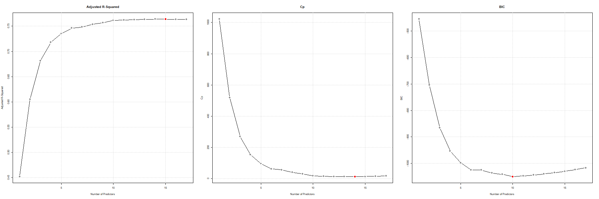

# Regression Modelling with the ISLR2 College Dataset in R

This repository presents a regression analysis performed on the **College** dataset from the [`ISLR2`](https://cran.r-project.org/web/packages/ISLR2/index.html) package in R.  

The analysis explores relationships between various institutional characteristics and student outcomes to demonstrate statistical modelling techniques using R.

---

## 🎯 Objectives
- Explore and visualise the College dataset.
- Apply multiple linear regression techniques.
- Evaluate model performance and interpret significant predictors.
- Demonstrate data cleaning, exploratory analysis, and regression diagnostics.

---

## 🗃️ Dataset
The `College` dataset is included in the `ISLR2` R package and contains information on U.S. colleges such as:
- Number of applications and acceptances
- Tuition and room costs
- Graduation rate
- Student-to-faculty ratio
- Type of institution (Private or Public)

---

## ⚙️ Methods
1. Data exploration and summary statistics  
2. Linear and multiple regression modelling  
3. Model diagnostics and residual analysis  
4. Variable transformations to improve fit  
5. Best subset selection to identify optimal predictors  
6. Polynomial regression and evaluation using cross-validation (Holdout, LOOCV, k-Fold)  

---

## 📁 Project Structure
```
college-regression-analysis/
│
├── college_regression_analysis.R     # Main R script with full analysis
├── install_packages.R                # Install all required R packages
├── college_regression_report.pdf     # Written assignment report
├── figures/                          # Generated plots and diagnostic visualisations
│   ├── model_diagnostics_original.png
│   ├── studentized_residuals_original.png
│   └── ...
├── README.md                          # Project overview and instructions
├── .gitignore                         # Files/folders excluded from Git
├── LICENSE                            # MIT License
└── college-regression-analysis.Rproj  # RStudio project file for reproducibility
```

---
## 🧰 Reproducibility
To reproduce the analysis:

1. Clone the repository:  
```bash
git clone https://github.com/ChokZB/college-regression-analysis.git
````

2. Open the R project in RStudio:

```r
college-regression-analysis.Rproj
```

3. Install all required packages:

```r
source("install_packages.R")
```

4. Run the main script:

```r
source("college_regression_analysis.R")
```

---

## 📈 Results Preview

Below is a sample output from the regression and model selection analyses.

### Best Subset Selection Metrics



---

## 🧑‍💻 Author

**Chok Zu Bing**
GitHub: [@ChokZB](https://github.com/ChokZB)

---

## 📄 License

This project is released under the [MIT License](LICENSE).
